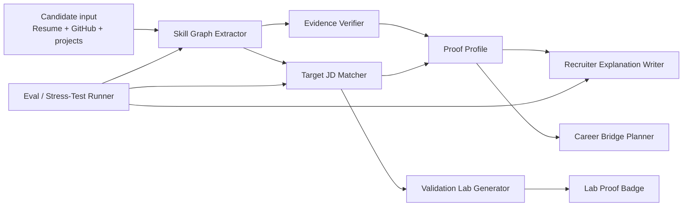

# HireGEN - Agentic Skills Roadmap

**Last updated:** 2026-05-27  
**Purpose:** Identify the specific agentic skills HireGEN should build or integrate without distracting from the hackathon MVP.

---

## Honest Recommendation

Yes, HireGEN needs agentic skills, but not a heavy multi-agent framework before Friday.

For the hackathon, the right move is to build "agent-like skills" as small, testable modules behind the existing API:

- predictable input/output schemas,
- evidence-first extraction,
- strict scoring rules,
- visible uncertainty,
- simple eval logs.

After the MVP is stable, these modules can be moved into OpenAI Agents SDK, NVIDIA Agent Intelligence Toolkit / AI-Q, LangGraph, Hermes, or an MCP-style tool layer.

---

## Skills To Build First

| Priority | Skill | What it does | Why it matters |
|---|---|---|---|
| P0 | Skill Graph Extractor | Converts resume, GitHub, and project links into normalized skills, evidence refs, badges, gaps, and roadmap items | Core product intelligence |
| P0 | Target JD Matcher | Compares candidate evidence against required JD skills as direct match, logical transfer, or missing proof | Fixes the exact scoring issue found in manual testing |
| P0 | Eval / Stress-Test Runner | Runs a matrix of resumes x JDs, records hallucinations, score fairness, extraction misses, and generic advice | Keeps the product honest under pressure |
| P1 | Git Portfolio Analyzer | Reads repo metadata, README quality, live URLs, tests, commit cadence, project completeness, and ownership signals | Makes GitHub proof real instead of keyword-only |
| P1 | Recruiter Explanation Writer | Produces shortlist reasons, risk flags, interview prompts, and next actions from the skill graph | This is where recruiters feel the value |
| P1 | Evidence Verifier | Confirms claims against supplied artifacts only: resume text, GitHub, live project URLs, labs, certificates | Anti-hallucination layer |
| P2 | Validation Lab Generator | Creates role-specific timed lab tasks from candidate profile + target role | Turns claims into proof |
| P2 | Career Bridge Planner | Builds 3-month or 6-month learning/project path using market role requirements | Candidate monetization path |
| P2 | Market Research Skill | Uses cited market data for role demand, skill trends, roadmap suggestions, and training-provider links | Useful later when affiliates/partners are added |

---

## Framework / Tool Fit

| Tool | Fit for HireGEN | Use now? | Notes |
|---|---|---|---|
| OpenAI structured outputs + current API | Strong | Yes | Keep using this now. It is enough for the MVP and easiest to test. |
| OpenAI Agents SDK | Strong after MVP | Later | Useful for tool use, handoffs, guardrails, sessions, and tracing once workflows become multi-step. |
| OpenAI Responses API tools | Medium/Strong | Later | File Search can help with private candidate docs; Web Search can help market/career research when citations are required. |
| OpenAI Evals | Strong | Later or lightweight now | Good fit for scoring drift and hallucination regression tests. Start with our own CSV/Markdown scorecard first. |
| NVIDIA Agent Intelligence Toolkit / AI-Q | Strong strategic fit | Later | Fits the earlier NVIDIA direction: portable research/agent skills, profiling, observability, evaluation, and MCP support. |
| LangGraph | Medium | Later | Useful if we need explicit graph workflows, retries, state, and human-in-the-loop. Heavy for this week. |
| E2B sandbox | Strong for labs | Later | Best candidate for safe code/lab execution environments. Not needed until Validation Lab preview becomes executable. |
| Hermes Agent framework | Strategic/internal | Later | Keep as the long-term self-improving agent layer, but do not let it slow Day-3/Day-5 delivery. |

---

## Product Agent Model

HireGEN should eventually behave like a coordinated team of specialized evaluators:

---

## Day-3 To Day-5 Build Order

### Day 3

1. Keep current MVP stable.
2. Build the 12-case stress-test dataset from `docs/STRESS-TEST-PLAN.md`.
3. Run at least 3 profile-baseline tests and 3 target-gap tests.
4. Log failure cases: missed resume facts, inflated scores, hallucinated proof, generic advice.

### Day 4

1. Patch extraction/scoring from test results.
2. Add Validation Lab preview as UI + generated task spec, not full sandbox execution.
3. Improve recruiter dashboard language using real stress-test cases.

### Day 5

1. Final production smoke.
2. Demo video.
3. Public repo check.
4. Final submission package.

---

## Sources Reviewed

- OpenAI Agents SDK: `https://platform.openai.com/docs/guides/agents-sdk/`
- OpenAI Responses API tools: `https://platform.openai.com/docs/guides/tools?api-mode=responses`
- OpenAI File Search: `https://platform.openai.com/docs/guides/tools-file-search/`
- OpenAI Web Search: `https://platform.openai.com/docs/guides/tools-web-search?api-mode=responses`
- OpenAI Evals API: `https://platform.openai.com/docs/api-reference/evals`
- NVIDIA Agent Intelligence Toolkit: `https://docs.nvidia.com/agent-toolkit/index.html`
- NVIDIA AI-Q blueprint repo: `https://github.com/NVIDIA-AI-Blueprints/aiq`
- LangGraph workflows and agents: `https://docs.langchain.com/oss/python/langgraph/workflows-agents`
- E2B documentation: `https://www.e2b.dev/docs`
- JSON Resume schema: `https://jsonresume.org/schema`
- Kaggle Updated Resume Dataset: `https://www.kaggle.com/datasets/jillanisofttech/updated-resume-dataset`
- Hugging Face resume datasets index: `https://huggingface.co/datasets?other=resume`
