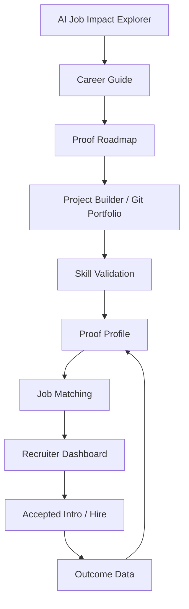

# HireGEN - Product Modules Backlog

> Living backlog for product modules, expansion ideas, validation mechanisms, and profile types.
> Capture ideas here before they become formal decisions in `docs/DECISIONS.md`.
> This is the canonical module backlog. `docs/MODULES-BACKLOG.md` is retained only as an archived pointer.

**Last updated:** 2026-05-27  
**Status:** Canonical working backlog  
**Collaborators:** Codex + Claude Code

---

## 0. Current Product Scope

HireGEN must stay centered on one thesis:

> Turn scattered candidate evidence into recruiter-trusted proof of capability.

The product is not only for Tier-2/3 candidates. It is for all candidates and recruiters, with stronger upside for under-discovered talent whose proof is real but not visible through pedigree, referrals, or resume polish.

### Phase Plan

| Phase | Goal | Modules |
|---|---|---|
| Hackathon MVP | Prove the proof-profile flow | Profile baseline, target-role gap, Git/live project signals, recruiter proof view, 1-page brief |
| Wave 1 | Build trusted supply | Career Guide, Git portfolio analyzer, proof badges, student/employee profile modes |
| Wave 2 | Build recruiter value | Recruiter dashboard, job matching, accepted intro workflow, validation/lab proof |
| Wave 3 | Build acquisition loops | AI Job Impact Explorer, public career audits, college/bootcamp validation programs |

### Immediate Priorities

| Priority | Item | Why |
|---|---|---|
| P1 | Recruiter dashboard polish | Recruiters are the paying side; their view must feel useful. |
| P1 | Product brief polish | Day-3 MVP checkpoint artifact. |
| P1 | Proof profile quality testing | Needs more resumes, GitHub links, project links, and JDs. |
| P2 | Final logo + badge usage | Improves trust and brand recall. |
| P2 | Public mirror sync | Keep public repo updated without leaking private context. |
| P2 | Backlog hygiene | Avoid parallel Codex/Claude source-of-truth drift. |

---

## 1. Context

HireGEN started as a skill-validated hiring platform:

> LinkedIn shows who you are. HireGEN proves what you can do.

The product is now expanding into adjacent modules that can build traction before the full hiring marketplace is liquid.

These modules should strengthen the proof layer, not dilute it into a generic resume or job-board product.

---

## 2. New Module: Resume Analyzer + Career Guide

### Working Name

Career Guide / Career Path Analyzer

### Original User Idea

A person uploads their resume and provides:

- The next role they want
- The technology they want to move into
- Their career ambition

HireGEN should analyze:

- Current profile match with the target ambition
- Technical gaps
- Learning required
- Hands-on projects required
- 3-month or 6-month career path
- Market-aligned recommendations
- Future affiliate training-provider links once partnerships exist

### Important Product Framing

This should be framed as:

> Resume in. Proof roadmap out.

It should **not** become a generic AI resume generator.

Reason:

- Original strategy says HireGEN should not enable resume polish as the core product.
- The stronger wedge is helping users convert resume claims into proof, projects, validation, and job readiness.

Recommended positioning:

> Upload your resume to find what is missing, what to prove next, and how to become match-ready for your target role.

### Core Flow

1. User uploads resume.
2. User selects or types target role.
3. User selects target technology/domain.
4. System extracts current skills, experience, projects, education, and signals.
5. System compares current profile against target-role requirements.
6. System outputs:
   - Match score
   - Skill gaps
   - Missing proof
   - Recommended projects
   - Learning path
   - GitHub/portfolio recommendations
   - 3-month plan
   - 6-month plan
   - Suggested validations

### Example Output Sections

| Section | Purpose |
|---|---|
| Current Profile Summary | What the person currently signals from resume/profile. |
| Target Role Fit | How close they are to the desired role. |
| Technical Gap Map | Missing or weak technologies, frameworks, tools, or concepts. |
| Proof Gap Map | Missing projects, GitHub evidence, papers, case studies, or validation tests. |
| Learning Path | What to learn, in what order. |
| Hands-On Path | What to build to prove the learning. |
| 3-Month Plan | Aggressive near-term roadmap. |
| 6-Month Plan | More realistic transition roadmap. |
| Market Notes | Demand, salary range, role expectations, and hiring signals. |
| Affiliate Recommendations | Future training-provider links, clearly disclosed. |

### Revenue Potential

Possible monetization:

- Free basic analysis for acquisition.
- Paid deep report for candidates only if it does not violate the free-candidate principle.
- Employer/college-sponsored reports.
- Affiliate revenue from training providers.
- Cohort career-readiness product for colleges/bootcamps.

Decision needed:

> Does "free forever for candidates" allow paid premium career reports, or should all candidate-side money come indirectly through institutions/affiliates?

---

## 3. New Module: AI Job Market Impact Explorer

### Working Name

AI Job Impact Explorer / Future of Work Map

### Original User Idea

A fun, futuristic UI showing how AI is impacting the job market:

- Which AI features affect which job functions
- Which roles are being automated, augmented, or transformed
- Data-driven results
- Futuristic interface
- Useful for engagement and traction

### Product Purpose

This module is partly educational, partly viral, partly strategic.

It can help users answer:

- Is my role at risk?
- Which parts of my job are changing because of AI?
- Which skills should I build next?
- Which roles are becoming more valuable?
- Which AI tools should I learn?

### Recommended UI Concept

A futuristic interactive map:

- Role search
- AI feature radar
- Task-level impact map
- Automation vs augmentation score
- Skill survival score
- Future-proof learning path
- Timeline view: now / 12 months / 3 years
- Compare roles side-by-side

### Example Data Model

| Entity | Examples |
|---|---|
| Role | Frontend Engineer, QA Tester, Recruiter, Data Analyst |
| Job Function | Testing, documentation, coding, analysis, customer calls |
| AI Feature | Code generation, summarization, agents, voice AI, image generation |
| Impact Type | Automates, augments, accelerates, commoditizes, creates demand |
| Risk Score | Low / medium / high |
| Opportunity Score | Low / medium / high |
| Recommended Skill | Prompting, system design, AI-assisted QA, data storytelling |

### Traction Angle

This can be a top-of-funnel tool:

1. User searches their current role.
2. Tool shows how AI affects that role.
3. Tool recommends future-proof skills.
4. User is invited to create a HireGEN proof profile.
5. Career Guide converts the insight into a roadmap.
6. Validation module turns roadmap progress into proof.

### Data Caution

This must be clearly labeled as:

- Data-informed
- Directional
- Updated periodically
- Not a guaranteed labor-market prediction

---

## 4. Anti-Cheat and Skill Validation System

### Problem

HireGEN's credibility depends on whether recruiters trust the proof.

If candidates can cheat using AI-generated answers, copied projects, or inflated claims, the platform loses its core value.

### Required Principle

Validation must measure:

> Can this person actually do the work under realistic constraints?

### Validation Types

| Validation Type | Description | Anti-Cheat Mechanism |
|---|---|---|
| Typed response | Candidate must type reasoning or explanation in-session. | Keystroke timing, paste blocking, originality checks. |
| No-AI answer | Question must be answered without AI-generated text. | Browser restrictions, paste detection, response-style anomaly detection. |
| Lab test | Candidate works inside a controlled coding/test environment. | Time box, logs, environment telemetry, reproducible tasks. |
| Project defense | Candidate explains their own project decisions. | Follow-up questions tied to repo details. |
| GitHub analysis | System reads commits, diffs, repo history, and patterns. | Detects real contribution vs copied/uploaded code. |
| Live debugging | Candidate fixes a seeded bug in a small environment. | Measures practical troubleshooting. |
| Architecture review | Candidate reviews trade-offs in a scenario. | Harder to fake with generic AI output. |

### Controlled Testing Environment

HireGEN should eventually spin up small test environments based on candidate profile and project history.

Examples:

- Frontend candidate gets a small React/Vite app with bugs and feature requests.
- Backend candidate gets an API service with failing tests.
- Data candidate gets a messy dataset and analysis prompt.
- DevOps candidate gets a broken deployment config.
- QA candidate gets a feature spec and buggy implementation.

### Environment Requirements

- Disposable sandbox.
- Time-boxed session.
- Logs actions.
- Blocks or flags paste where appropriate.
- Captures test runs.
- Stores final diff.
- Generates evidence artifact for profile.
- Produces recruiter-readable summary.

### Policy Tags

Each validation question/task should have policy tags:

| Tag | Meaning |
|---|---|
| `typed_required` | Candidate must type the answer manually. |
| `paste_blocked` | Pasting is blocked or flagged. |
| `no_ai_text` | AI-generated text is prohibited. |
| `lab_required` | Must be completed in controlled environment. |
| `repo_based` | Task is generated from candidate's actual repo/project. |
| `oral_defense` | Candidate must explain choices verbally or in written defense. |
| `open_resource` | External docs allowed, but direct AI answer generation not allowed. |
| `closed_book` | No external resources allowed. |

### Important Design Note

The goal is not to create a hostile exam product.

The tone should be:

> We protect your proof so recruiters trust it.

Candidate-facing copy should explain that stricter validation increases credibility.

---

## 5. Git Portfolio and Project Analysis

### Original User Note

Going forward, every person should build projects and have a Git portfolio. HireGEN should read and analyze that portfolio.

The user already has tools for this and expects them to be modified later.

### Product Goal

GitHub/project analysis should become a central part of the proof layer.

The system should analyze:

- Repo structure
- Commit history
- Code quality
- Test coverage
- Documentation
- Project complexity
- Real-world usefulness
- Ownership signals
- Consistency over time
- AI/copy-paste suspicion signals
- Deployment/demo availability

### Candidate Benefit

The output should help candidates improve:

- Which repo to feature
- What README to improve
- What tests to add
- What deployment to create
- What case study to write
- Which project proves which skill

### Recruiter Benefit

Recruiters should see:

- Candidate's strongest proof artifacts
- Skill evidence from code
- Practical quality indicators
- Risk flags
- Interview questions generated from actual work

### Integration With Career Guide

Career Guide should recommend projects.

Git analysis should verify whether those projects were actually built and whether they demonstrate the intended skills.

---

## 6. Profile Types: Student vs Employee

HireGEN should support at least two major profile modes.

Both can match with jobs, but the evidence model should differ.

---

## 6.1 Student Profile

### Primary Signals

- Projects
- GitHub repositories
- Academic subjects
- Seminars
- Papers
- Thesis / dissertation work
- PhD or research work
- Hackathons
- Internships
- Certifications
- Lab work
- Faculty/mentor references
- Campus placement readiness

### Product Focus

Student profiles should emphasize:

- Potential
- Learning velocity
- Project depth
- Academic strength
- Research ability
- Practical readiness
- Portfolio quality

### Matching Logic

Student matching should weigh:

- Project relevance
- Skill validation
- Academic alignment
- Internship readiness
- Learning trajectory
- Location preference
- Role ambition

### Example Student Proof Areas

| Area | Evidence |
|---|---|
| Projects | GitHub, demo, report, screenshots, deployment |
| Research | Paper, thesis, poster, seminar deck |
| Subjects | Coursework mapped to job skills |
| Labs | Practical assignments and experiments |
| Communication | Seminar/video explanation |

---

## 6.2 Employee Profile

### Primary Signals

- Hands-on work experience
- Role responsibilities
- Projects shipped in companies
- Management experience
- Domain experience
- Tools and technologies used professionally
- Business outcomes
- Team leadership
- Architecture decisions
- Cross-functional collaboration
- Certifications
- Git/work artifacts where available

### Product Focus

Employee profiles should emphasize:

- Proven execution
- Depth of expertise
- Professional responsibility
- Impact
- Leadership
- Domain fluency
- Production experience

### Matching Logic

Employee matching should weigh:

- Years and depth of relevant experience
- Technology match
- Domain match
- Project impact
- Leadership or IC track
- Compensation fit
- Notice period
- Location/remote preference
- Interview readiness

### Example Employee Proof Areas

| Area | Evidence |
|---|---|
| Technical execution | Work projects, architecture notes, code samples where allowed |
| Business impact | Metrics, revenue, cost savings, performance improvements |
| Leadership | Team size, mentoring, delivery ownership |
| Domain expertise | Fintech, SaaS, healthcare, edtech, etc. |
| Career mobility | Transition readiness and skill gap plan |

---

## 7. Combined Product Ecosystem

The modules should connect into one journey.

### Intended Journey

1. User discovers role risk/opportunity through AI Job Impact Explorer.
2. User uploads resume and selects target role in Career Guide.
3. System generates learning + project roadmap.
4. User builds or improves Git portfolio.
5. System analyzes projects and validates skills.
6. User gets a proof profile.
7. Recruiters see validated matches.
8. Hiring outcomes improve the platform's signal.

---

## 8. Agent Skill Architecture Direction

The NVIDIA AI-Q / deep research skill pattern is relevant to HireGEN's future architecture.

Reference:

- https://developer.nvidia.com/blog/add-a-specialized-deep-research-skill-to-agent-harnesses/

The important idea is to avoid making one generic AI agent do everything. Instead, HireGEN can expose specialized product capabilities as skills.

Potential HireGEN skills:

| Skill | Purpose |
|---|---|
| Skill Graph Skill | Extract, normalize, and score candidate skills from evidence. |
| Career Research Skill | Research target roles, market expectations, salary bands, and learning paths. |
| Git Portfolio Skill | Analyze repositories, commit history, project quality, and ownership signals. |
| Validation Lab Skill | Generate and evaluate lab tasks with anti-cheat policies. |
| Recruiter Match Skill | Rank candidates against job requirements with evidence-backed explanations. |
| AI Market Impact Skill | Map AI capabilities to job-function impact and future-proof skills. |

This architecture fits both Codex and Claude Code collaboration because each harness can delegate specialized work while preserving clear inputs, outputs, and audit trails.

---

## 9. Decisions Needed

| ID | Decision | Notes |
|---|---|---|
| PM-001 | Is Career Guide candidate-free forever? | Needs alignment with candidate monetization policy. |
| PM-002 | Do we call it Resume Builder or Career Guide? | "Resume Builder" conflicts with proof-over-resume positioning. |
| PM-003 | Which profile type ships first? | Student, employee, or both? |
| PM-004 | Which role/tech segment does Career Guide support first? | Recommended: frontend/full-stack. |
| PM-005 | What anti-cheat strictness is acceptable? | Must balance trust and candidate experience. |
| PM-006 | What existing Git/project analysis tools will be integrated? | User has tools to modify later. |
| PM-007 | Which module drives first traction? | Career Guide and AI Job Impact Explorer are likely top-of-funnel. |
| PM-008 | Do we implement modules as explicit agent skills? | NVIDIA AI-Q pattern suggests this could become the long-term architecture. |

---

## 10. Notes for Future Updates

When adding new modules:

- Connect them back to proof, validation, or hiring outcomes.
- Avoid broad feature sprawl.
- Mark whether the module is:
  - Acquisition
  - Activation
  - Validation
  - Monetization
  - Retention
- Add formal product decisions to `docs/DECISIONS.md` only after the direction is confirmed.

---

## 11. Update Log

| Date | Update | Author |
|---|---|---|
| 2026-05-16 | Captured new module ideas: Career Guide, AI Job Impact Explorer, anti-cheat validation, Git portfolio analysis, student/employee profiles. | Codex |
| 2026-05-22 | Added NVIDIA AI-Q inspired agent skill architecture direction. | Codex |
